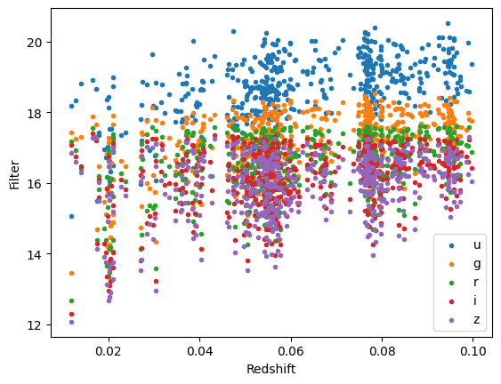
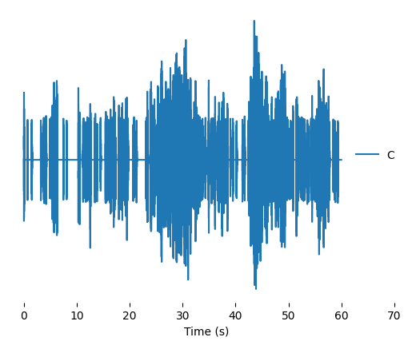

--- 
layout: post 
title: Week 1 Blog Post 
date: 2025-06-06 
tags: student-blog
featured: true 
---

# Sonification Week 1 Blog Post

## Introduction to our project 

 Our goal for this project is to explore how we can represent otherwise intangible media using sound. Specfically, we'd like to explore an astrophysical phenomena and repesent it in a more tangible way.

 There are four students working on this project: two astrophysics students, one music student, and one fine art student. As well as developing a final sonification for this project, our overall goal is to also focus on how we work as an interdisciplinary team. We all have very different knowledge backgrounds, and aim to apply our skillsets to acheive a collective, more well-rounded project. 

## Summary of Week 1

 Our aim for the first week was to get to know one another and explore our initial ideas. From the start, we were all very excited to get started working together as an interdisciplinary team. The prospect of combining physics and data in a creative way was something we found very intriguing.

The first week of our four week project focused on getting to know one another and laying down a foundation for our initial ideas.

 - Day 1 began with our first team meeting since the start of the project where we got to know one another and began brainstorming our initial ideas whilst exploring the resources provided
- The second day was dedicated to further developing these ideas, and discussing potential directions that our project could take 
 - On the third day of the project we met with our project supervisors, where they gave us a brief overview of the field of Sonification and guided us towards some potential approaches we could take. We also completed a Strauss workshop to help us with our project.
 - On days 4 and 5, we focused on attempting to make our Sonifcation using real galaxy data using Strauss. We also experimented with a synthesiser to outline another method we could use to sonify data.

## Our initial ideas and first sonification
 
 After exploring many different avenues, we collectively decided that we'd like to use Sonifcation to explore astrophysical data. Some of our initial ideas included: tracking the evolution of a galaxy through its main sequence and subsequent red giant/wite dwarf branch, and exploring what happens to a particle approaching a black hole from multiple observation points. 

 To begin with, we wanted to plot a basic graph using some real data to allow us to experiment with the sound that can be produced from this. To do this, we decided to use a subset of galaxy data that the physics students had used for a previous course. We took the redshift and colour indices of 500 galaxies from this set. The graph below shows the data plotted as colour index against redshift:
 
 

 To attempt our first Sonifcation, we took only the u-band and plotted this against redshift. We then used Strauss to treat each data point as an event that producees its own sound to make an overall representation of the amplitude of the graph using a varying pitch for each data point. The graph, and accompanying Sonifcation can be seen below:

  

 
  [link to Sonifcation ](https://newcastle.sharepoint.com/:u:/s/SonificationSummerProject2025/EUwCvtlG5nlDlCVJJTTvTBsBxgeW6JOLKB_pjb9YAnckaQ?e=IdXmvk).

## Thoughts and feelings after the first week

 Below is a brief summary of how we felt starting this project, with some quotes from each of the students. 

 We all found the first meeting ‘initially a little awkward’ as an interdisciplinary project of this sort was very new for all of us, but we ‘quickly managed to find overlap in each of our interests, coming up with ideas and starting points - bouncing ideas off of each other.’ We also found it quite ‘daunting’ and were a bit aprehensive as the project ‘seemed far more open-ended’ than we had perhaps anticipated.

 The non-physics students found the coding aspect of this week ‘challenging’ as this was something they hadn’t worked with before. Whilst the physics students found the more creative and artistic aspect 'harder to grasp and interpret'.

 However, seeing each persons respective fields overlap helped us to all feel more ‘comfortable and highlighted the positive nature of this interdisciplinary project’.

 Overall, the group feels very excited and motivated going forward, and we look forward to expanding upon our initial ideas in more detail.

